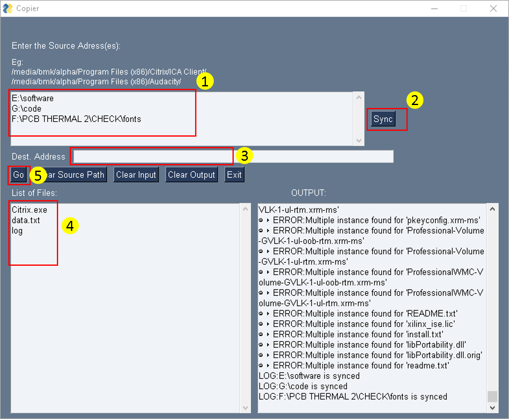

# Copier

This tool is to copy files from large project when you have the required file names in first place."copier.py" is the source code. 

"copier.exe" is the windows executable. "copier" is the linux and unix executable.

# Dependencies for source code are as follows:
  1. PySimpleGUI
  2. Portalocker
  
# Steps for usage:
  1. Enter the list of source directory.
  2. Click on Sync button.
  3. Enter the Destinaion directory.
  4. Enter the List of files that needs to be copied from the source.
  5. Click on Go to copy the files.

# Demo Image

